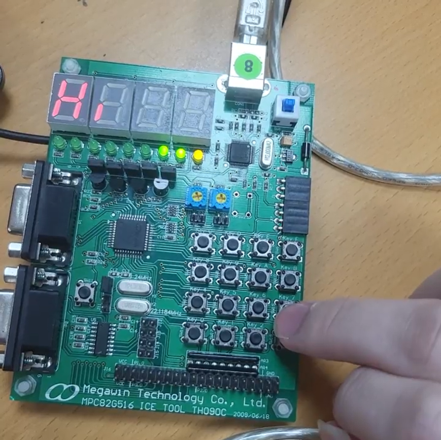

# Guess Number Game
## 1131 嵌入式微處理器系統期末專題
A number guessing game on MPC82G516 dev board. 
A classic number guessing game on MPC82G516 dev board.
Where the player attempts to guess a randomly generated 4-digit number (0-9999).
The game provides visual feedback through LEDs and a 4-digit display to guide the player toward the correct answer.

## Demo Video:
[Google Drive](https://drive.google.com/file/d/1vlxE6L2xAR8tb6_vr-EcZbru_Gw8u6qu/view?usp=sharing)

## Rule:

Press button F (New) to start a new game
System generates a random number between 0-9999 (Using timer)
Enter your guess using number buttons 0-9
Use button B as backspace to correct mistakes
Press button C (Check) to submit your guess
System responds with:
"Hi" if your guess is too high (right LEDs on)
"Lo" if your guess is too low (left LEDs on)
Number of attempts if correct (all LEDs on)

## Controll

0-9: Enter digits
B: Backspace/delete last digit
C: Check your guess
F: Start new game